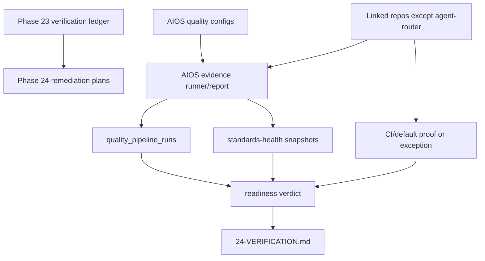

# Phase 24: Rectify Linked Repo AIOS Readiness Blockers Except Agent-Router - Research

**Researched:** 2026-06-24
**Domain:** AIOS linked-repo quality governance and release-readiness evidence
**Confidence:** HIGH

## User Constraints

- [VERIFIED: user request] Phase 24 must rectify the linked-repo AIOS readiness blockers recorded by Phase 23.
- [VERIFIED: user request] `agent-router` is explicitly excluded from Phase 24.
- [VERIFIED: `.planning/phases/23-mature-linked-repositories-to-aios-strict-release-readiness/23-VERIFICATION.md`] Dirty trees are tracked separately from readiness and are lower priority than real gates, CI/default proof, quality-pipeline evidence, and class-specific blockers.
- [VERIFIED: `docs/quality/linked-repo-strict-release-readiness.md`] Repo-local `.aios-quality-gate.json` files remain declarations only; executable commands stay AIOS-owned.

## Summary

Phase 23 produced the strict-readiness contract and a complete ledger, but it intentionally did not mark any repo adoption-ready. [VERIFIED: `23-VERIFICATION.md`] The current portfolio state is 0 ready repos, 2 evidence-required repos (`soundscape-app`, AIOS), and 21 blocked repos. Excluding `agent-router`, Phase 24 needs to resolve 22 repos.

The work should be planned as a class-based remediation program. Evidence capture needs to be standardized first so repo work can record durable `quality_pipeline_runs` rows, standards-health proof, CI/default-branch proof, blockers, exceptions, and dirty-tree notes consistently. After that, class groups can be fixed in ordered waves that avoid shared registry conflicts, followed by a proof sweep and final ledger.

**Primary recommendation:** Build an AIOS evidence runner/reporting loop first, then execute repo-class remediation waves, leaving `agent-router` excluded from Phase 24 and blocked for a separate product-maturation phase.

## Architectural Responsibility Map

| Capability | Primary Tier | Secondary Tier | Rationale |
| --- | --- | --- | --- |
| Quality command ownership | AIOS control plane | Linked repos | AIOS owns executable commands in `config/quality-*.json`; repos declare gate IDs only. |
| Evidence recording | AIOS SQLite/services | Linked repos | `quality_pipeline_runs` and standards-health snapshots are AIOS-owned proof records. |
| Repo-local gate implementation | Linked repos | AIOS config | Missing scripts, CI workflows, and validators must live where the repo can run them. |
| CI/default proof | Linked repos | AIOS truth/reporting | Repos expose workflows or exceptions; AIOS records the proof status. |
| Final readiness verdict | AIOS control plane | Phase verification ledger | Readiness must be derived from recorded evidence, not optimistic prose. |

## Standard Stack

### Core

| Tool/File | Version | Purpose | Why Standard |
| --- | --- | --- | --- |
| Python stdlib + `sqlite3` | Python 3.12+ per `pyproject.toml` | Evidence runner/reporting service | Existing AIOS services use Python and SQLite for durable local-first state. |
| `services.quality_pipeline` | repo-local | Read and record quality-pipeline gate evidence | Existing schema and APIs already own `quality_pipeline_runs`. |
| `services.project_health_proof` | repo-local | Active-inventory standards-health proof | Phase 23 fixed all-inventory contamination here. |
| `config/quality-pipeline.json` | repo-local | Class gate registry and blockers | Existing strict-readiness config source. |
| `config/quality-gates.json` | repo-local | Allowlisted gate declarations | Existing commit-gate/adapter source. |

### Supporting

| Tool/File | Purpose | When to Use |
| --- | --- | --- |
| `validate_commit_quality_gate(..., run=False)` | Contract validation | Every plan touching repo-local gate declarations. |
| `pnpm context:validate` | Context compiler validation | Every AIOS config/truth change. |
| `uv run pytest -q tests/test_quality_gates.py tests/test_commit_quality_ladder.py tests/test_tier_one_regressions.py tests/test_quality_pipeline.py` | Focused AIOS regression suite | Any AIOS registry, pipeline, or health-proof change. |
| `pre-cr run --json --workspace {repo_root}` | Changed-line readiness | Repos with `.pre-cr.json`; not a substitute for class gates. |

### Alternatives Considered

| Instead of | Could Use | Tradeoff |
| --- | --- | --- |
| AIOS evidence runner | Manual per-repo command notes | Manual notes caused the Phase 23 “no fresh evidence” blocker and are not durable enough. |
| Class-specific gates | One universal app gate | Would fake app semantics for data/content repos and repeat the Phase 23 floor-only problem. |
| Immediate dirty-tree cleanup | Gate/evidence remediation first | Dirty trees are easy atomic commits; real blockers are missing gates and proof. |

## Architecture Patterns

### System Architecture Diagram



### Recommended Project Structure

```text
services/
  quality_pipeline.py              # Existing evidence schema/API
  project_health_proof.py          # Existing all-inventory proof
  linked_repo_readiness.py         # Phase 24 candidate for portfolio readiness aggregation
scripts/
  linked-repo-quality-runner.py    # Phase 24 candidate CLI for local gate runs/evidence
tests/
  test_linked_repo_readiness.py    # Phase 24 focused coverage
```

### Pattern 1: Evidence Before Verdict

**What:** A repo can move to `ready` only after gate commands have fresh `pass` records and CI/default proof or exception is recorded.
**When to use:** Every Phase 24 repo remediation.
**Source:** [VERIFIED: `docs/quality/linked-repo-strict-release-readiness.md`]

### Pattern 2: Class-Specific Validation

**What:** Web apps get env/security/smoke/e2e gates; packages get package/CLI/consumer smoke gates; data/course repos get install/lint/type/test/validation gates; content/container repos get aggregate/delegated validation.
**When to use:** Every repo-specific plan.
**Source:** [VERIFIED: `docs/quality/linked-repo-strict-release-readiness.md`]

### Pattern 3: Explicit Exception Instead Of Silent Missing CI

**What:** If remote CI is inappropriate, record owner, reason, review date, local proof command, and replacement path.
**When to use:** Vaults, BBDSE, course/data repos, or local-only repos where remote CI is not appropriate.
**Source:** [VERIFIED: `docs/quality/linked-repo-strict-release-readiness.md`]

## Don't Hand-Roll

| Problem | Don't Build | Use Instead | Why |
| --- | --- | --- | --- |
| Evidence storage | New JSON evidence store | `quality_pipeline_runs` via `services.quality_pipeline` | Existing schema already supports gate, status, source, evidence, timestamps, metadata. |
| Inventory proof | New inventory scanner | `prove-project-health --all-inventory` | Existing service now filters active inventory correctly. |
| Secret/dependency proof | Ad hoc grep-only readiness | Repo-appropriate tools plus AIOS evidence rows | Release readiness needs durable pass/fail records. |
| Container readiness | Treat BBDSE as one app | Delegated child-project ownership + aggregate proof | BBDSE is a container and needs child-gate rollup. |

## Common Pitfalls

### Pitfall 1: Declaring Readiness From Config Presence
**What goes wrong:** A repo has configured gates but no fresh passing evidence.
**How to avoid:** Require `quality_pipeline_runs` pass records and standards-health snapshots before marking ready.

### Pitfall 2: Reintroducing Floor Gates
**What goes wrong:** `git diff --check`, `py_compile`, or `.pre-cr.json` becomes the claimed standard.
**How to avoid:** Treat those as floor checks unless paired with class-specific validation and CI/exception proof.

### Pitfall 3: Cross-Repo Commits Become Mixed
**What goes wrong:** One huge dirty tree spans many repos and makes rollback impossible.
**How to avoid:** Each execution plan scopes repo sets and requires atomic commits per repo concern before moving on.

### Pitfall 4: Agent-Router Scope Leak
**What goes wrong:** Generic developer-tool remediation accidentally includes `agent-router`.
**How to avoid:** Every plan explicitly excludes `agent-router`; final verification checks it remains blocked/out of scope.

## State of the Art

| Old Approach | Current Approach | Source | Impact |
| --- | --- | --- | --- |
| Gate declaration as proof | Evidence rows plus CI/default proof | `23-VERIFICATION.md` | Prevents false adoption-ready claims. |
| Universal app gates | Class-specific strict standards | `docs/quality/linked-repo-strict-release-readiness.md` | Data/content repos avoid fake app gates. |
| All-inventory included defaults | Active inventory only | `services.project_health_proof` Phase 23 change | Prevents missing-source contamination. |

## Assumptions Log

| # | Claim | Section | Risk if Wrong |
| --- | --- | --- | --- |
| A1 | Repo-specific scripts/workflows can be added in linked repos during execution with normal filesystem approval where needed. | Summary | Some repo edits may need approval or separate commits. |
| A2 | Remote CI proof can be represented as workflow presence plus default-branch pass evidence or explicit exception. | Patterns | Final proof may need GitHub/API access or manual confirmation if unavailable. |

## Open Questions (RESOLVED)

1. **Should Phase 24 include `agent-router`?** RESOLVED: No. The user explicitly excluded `agent-router`.
2. **Should dirty trees drive plan order?** RESOLVED: No. Phase 23 says dirty trees are closeout hygiene and lower priority.
3. **Can repo-local `.aios-quality-gate.json` carry commands?** RESOLVED: No. Commands remain AIOS-owned.

## Validation Architecture

### Test Framework

| Property | Value |
| --- | --- |
| Framework | Pytest for AIOS services; repo-native commands for linked repos |
| Config file | `pyproject.toml`, `config/quality-pipeline.json`, repo-native package/CI config |
| Quick run command | `uv run pytest -q tests/test_quality_gates.py tests/test_commit_quality_ladder.py tests/test_quality_pipeline.py` |
| Full suite command | `uv run pytest -q tests/test_quality_gates.py tests/test_commit_quality_ladder.py tests/test_tier_one_regressions.py tests/test_quality_pipeline.py && pnpm context:validate` |

### Phase Requirements -> Test Map

| Req ID | Behavior | Test Type | Automated Command | File Exists? |
| --- | --- | --- | --- | --- |
| Phase goal | Evidence runner/report records readiness proof | unit/service | `uv run pytest -q tests/test_linked_repo_readiness.py tests/test_quality_pipeline.py` | ❌ Wave 0 |
| Phase goal | Repo contracts remain valid and exclude `agent-router` from readiness sweep | integration | `validate_commit_quality_gate(..., run=False)` across Phase 24 repo set | ✅ |
| Phase goal | Standards-health proof remains active-inventory clean | integration | `uv run python bin/aios.py --json prove-project-health --all-inventory` | ✅ |

### Wave 0 Gaps

- [ ] `tests/test_linked_repo_readiness.py` — portfolio readiness aggregation and exclusion behavior.
- [ ] `services/linked_repo_readiness.py` — if the evidence runner needs a reusable service boundary.
- [ ] `scripts/linked-repo-quality-runner.py` — if command execution/evidence recording is not already sufficient.

## Security Domain

### Applicable ASVS Categories

| ASVS Category | Applies | Standard Control |
| --- | --- | --- |
| V2 Authentication | no | No auth surface planned. |
| V3 Session Management | no | No session surface planned. |
| V4 Access Control | yes | Do not execute repo-local command declarations; keep allowlisted AIOS-owned commands. |
| V5 Input Validation | yes | Validate project IDs, gate IDs, paths, and status values before recording evidence. |
| V6 Cryptography | yes | Do not store secrets; secret scanning gates report pass/fail evidence only. |

### Known Threat Patterns

| Pattern | STRIDE | Standard Mitigation |
| --- | --- | --- |
| Repo-local command injection | Elevation of privilege | Only execute AIOS-owned commands from `config/quality-pipeline.json` / allowlisted adapters. |
| False readiness evidence | Repudiation | Store command, source, timestamp, status, and evidence in `quality_pipeline_runs`. |
| Secret leakage in logs | Information disclosure | Store evidence summaries and artifact paths, not raw secrets or full scanner dumps. |
| Cross-repo path confusion | Tampering | Resolve repo paths from active inventory and explicit Phase 24 allowlist excluding `agent-router`. |

## Sources

### Primary (HIGH confidence)

- `.planning/phases/23-mature-linked-repositories-to-aios-strict-release-readiness/23-VERIFICATION.md` — authoritative blocker ledger.
- `docs/quality/linked-repo-strict-release-readiness.md` — class-based strict readiness standard.
- `docs/audits/linked-repo-adoption-readiness-audit.md` — repo order, classes, and Phase 23 audit findings.
- `config/quality-pipeline.json` — current gate commands, classes, and blockers.
- `config/quality-gates.json` — current adoption maturity metadata.
- `services/quality_pipeline.py` — evidence schema/API.
- `services/project_health_proof.py` — standards-health proof behavior.

### Secondary (MEDIUM confidence)

- Linked repo local command surfaces inferred from Phase 23 config. Execution must re-read each repo before editing.

### Tertiary (LOW confidence)

- None.

## Metadata

**Confidence breakdown:**
- Standard stack: HIGH - all sources are local AIOS authority.
- Architecture: HIGH - Phase 23 defined ownership boundaries.
- Pitfalls: HIGH - derived from Phase 23 blockers.

**Research date:** 2026-06-24
**Valid until:** 2026-07-24 or the next linked-repo inventory/gate contract change.
