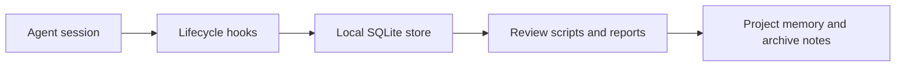

# AIOS

<p align="center"><strong>A local-first operating layer for agent sessions, durable memory, and reviewable automation.</strong></p>

<p align="center">
  
  
  
  
</p>

AIOS is a personal AI operating system: a local infrastructure layer for capturing agent sessions, preserving work context, importing useful AI-history archives, and turning repeated workflows into reviewable project memory.

The public default branch is an early foundation slice. It includes hook entrypoints, a SQLite initialization script, and planning/spec documentation for AI-history import. Larger local and feature-branch work may exist elsewhere, but this branch is intentionally described by what it currently publishes.

## Why It Exists

AI-assisted work produces useful signals that are easy to lose: prompts, decisions, tool events, project context, repeated fixes, and post-session lessons. AIOS keeps those signals in local stores so future work can start from evidence instead of chat archaeology.

## Public Branch Scope

| Area | Included here | Purpose |
| --- | --- | --- |
| Session hooks | `bin/hook-session-start.py`, `bin/hook-stop.py`, prompt/tool/precompact hooks | Capture lifecycle events from agent sessions. |
| Local storage bootstrap | `bin/init-db.sh` | Initialize the expected SQLite database once a schema is present. |
| AI-history design | `docs/specs/2026-04-01-ai-history-import-design.md` | Specify how exported AI conversations should become reviewable archive notes. |
| Execution planning | `docs/plans/2026-04-01-ai-history-import.md` | Preserve the implementation plan for the import/archive subsystem. |

## Architecture



AIOS is intentionally local-first. The working model keeps operational data on disk, uses SQLite for structured state, and treats Git repositories as the source of truth for code and reviewed documentation.

## Core Ideas

- Capture session events at the edges instead of reconstructing them later.
- Keep raw imports and generated review artifacts separate from human-curated notes.
- Promote knowledge only after review, not automatically.
- Make project state inspectable through small scripts and durable files.
- Prefer local, auditable storage over opaque background services.

## Getting Started

Clone the public branch:

```bash
git clone https://github.com/jakyeamos/AIOS.git
cd AIOS
```

Create the local directories expected by the hook scripts:

```bash
mkdir -p "$HOME/AIOS/data" "$HOME/AIOS/logs"
```

The included `bin/init-db.sh` expects a SQLite schema at `$HOME/AIOS/data/schema.sql`. Do not run it until that schema is present in your local AIOS installation.

## Documentation

- [AI-history import design](docs/specs/2026-04-01-ai-history-import-design.md)
- [AI-history import implementation plan](docs/plans/2026-04-01-ai-history-import.md)

## Operator Notes

This repository contains infrastructure that can sit close to an agent workflow. Before installing hooks into a live environment, review the scripts, confirm the database path, and test against a throwaway workspace.

## Status

AIOS is active infrastructure, but this default branch should be read as a public foundation slice rather than a complete product release. The README will need another pass when the dashboard, broader quality gates, workflow runtime, and full schema are promoted to the public branch.
