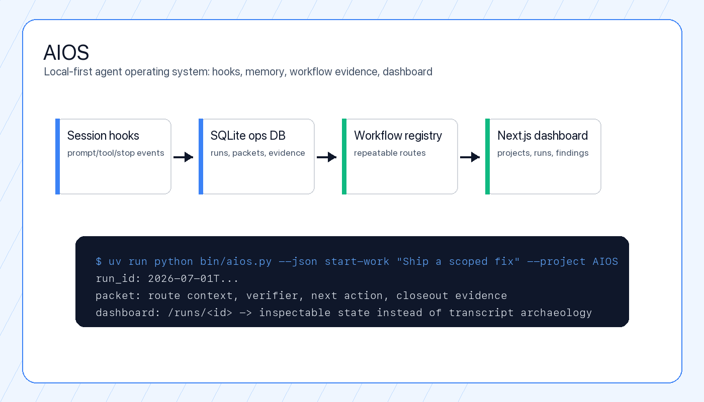
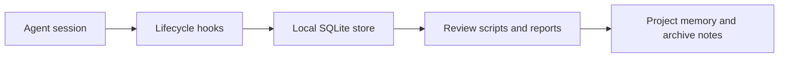

# AIOS

<p align="center"><strong>A local-first operating layer for agent sessions, durable memory, and reviewable automation.</strong></p>

<p align="center">
  
  
  
  
</p>

AIOS is a personal AI operating system: a local infrastructure layer for capturing agent sessions, preserving work context, importing useful AI-history archives, and turning repeated workflows into reviewable project memory.

This public branch presents the implementation as a case study: local session hooks, durable storage, workflow planning, and the operating principles behind a larger local AI workbench. It is written to show the architecture, the working surfaces that are public here, and the next pieces that would make the full local system easier to evaluate from a clean clone.



## Why This Matters

### Problem

AI-assisted work produces useful signals that are easy to lose: prompts, decisions, tool events, project context, repeated fixes, and post-session lessons. AIOS keeps those signals in local stores so future work can start from evidence instead of chat archaeology.

### Who It Helps

AIOS helps developers and agent operators who run serious multi-step work across projects and need durable context, route selection, quality evidence, and follow-up visibility after a chat window or terminal session ends.

### What I Built

I built a local-first operating layer around agent work: lifecycle hooks, SQLite-backed event capture, AI-history import planning, run/packet concepts, and a project-memory model that separates raw automation artifacts from reviewed notes.

### Technical Decisions

- Local files and SQLite are the default stores so the system remains inspectable and portable.
- Hook scripts capture events at session boundaries instead of trying to reconstruct work after the fact.
- Raw imported data, generated review artifacts, and curated notes are separate so automation does not silently become source-of-truth memory.
- The architecture treats Git repositories as reviewed state and AIOS as the operational layer around them.

### How To Run It

```bash
git clone https://github.com/jakyeamos/AIOS.git
cd AIOS
mkdir -p "$HOME/AIOS/data" "$HOME/AIOS/logs"
```

Review the hook scripts before wiring them into a live agent environment. The included `bin/init-db.sh` expects a SQLite schema at `$HOME/AIOS/data/schema.sql`.

### What I Would Improve Next

The strongest next public-facing improvement is promoting the dashboard, schema, and daily-use CLI path into this branch so a recruiter or teammate can run the full loop from a clean clone.

## Case Study

For more detail on the architecture and what works today, read [docs/case-study.md](docs/case-study.md).

## Public Branch Scope

| Area | Included here | Purpose |
| --- | --- | --- |
| Session hooks | `bin/hook-session-start.py`, `bin/hook-stop.py`, prompt/tool/precompact hooks | Capture lifecycle events from agent sessions. |
| Local storage bootstrap | `bin/init-db.sh` | Initialize the expected SQLite database once a schema is present. |
| AI-history design | `docs/specs/2026-04-01-ai-history-import-design.md` | Specify how exported AI conversations should become reviewable archive notes. |
| Execution planning | `docs/plans/2026-04-01-ai-history-import.md` | Preserve the implementation plan for the import/archive subsystem. |

## Architecture



AIOS is intentionally local-first. The working model keeps operational data on disk, uses SQLite for structured state, and treats Git repositories as the source of truth for code and reviewed documentation.

## Core Ideas

- Capture session events at the edges instead of reconstructing them later.
- Keep raw imports and generated review artifacts separate from human-curated notes.
- Promote knowledge only after review, not automatically.
- Make project state inspectable through small scripts and durable files.
- Prefer local, auditable storage over opaque background services.

## Getting Started

Clone the public branch:

```bash
git clone https://github.com/jakyeamos/AIOS.git
cd AIOS
```

Create the local directories expected by the hook scripts:

```bash
mkdir -p "$HOME/AIOS/data" "$HOME/AIOS/logs"
```

The included `bin/init-db.sh` expects a SQLite schema at `$HOME/AIOS/data/schema.sql`. Do not run it until that schema is present in your local AIOS installation.

## Documentation

- [AIOS case study](docs/case-study.md)
- [AI-history import design](docs/specs/2026-04-01-ai-history-import-design.md)
- [AI-history import implementation plan](docs/plans/2026-04-01-ai-history-import.md)

## Operator Notes

This repository contains infrastructure that can sit close to an agent workflow. Before installing hooks into a live environment, review the scripts, confirm the database path, and test against a throwaway workspace.

## Status

AIOS is active infrastructure presented here as a public case study. The next public milestone is a clean-clone release of the dashboard, schema, quality gates, workflow runtime, and daily-use CLI path.
