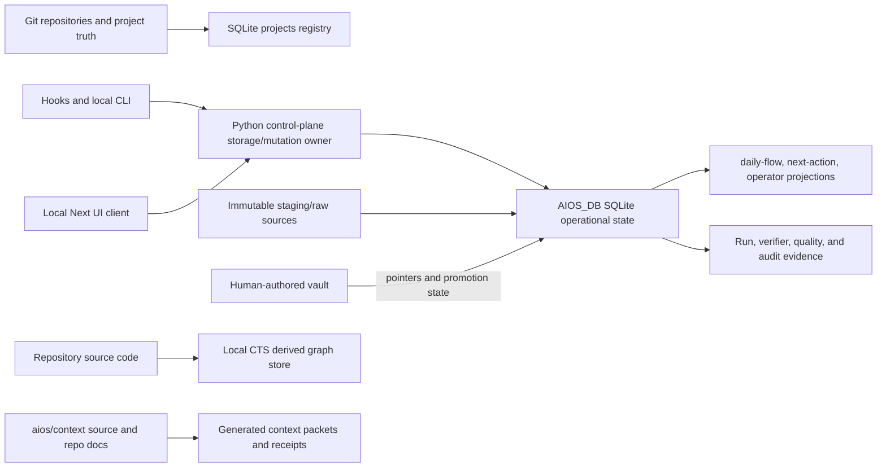

# ADR-002: Canonical State and Migration Authority

**Status:** Accepted v2 target contract 
**Date:** 2026-07-13 
**Scope:** Durable state ownership, schema evolution, recovery, and private
data handling. This decision does not modify the live database.

## Decision

AIOS v2 keeps one local operational database at `AIOS_DB` (default
`~/AIOS/data/aios.db`). The Python control plane owns the logical mutation and
migration authority. Hooks and CLI entry points remain supported adapters, but
they must converge on one shared connection/mutation contract. The Next UI is a
client and projection; it must not execute authoritative DDL or maintain a
second database-path contract.

The main store's schema authority is a versioned, checksummed migration ledger
owned by the Python control plane. An ordered migration set and its generated
bootstrap snapshot become the only supported way to create or upgrade the main
store. The current `schema.sql` and `data/schema.sql` are historical snapshots,
not two competing authorities: `data/schema.sql` is legacy bootstrap input and
must not receive new schema changes; the newer root snapshot is a migration
input that must be reconciled before it can become generated bootstrap output.

The main ledger must record at least `version`, `migration_id`, `checksum`,
`applied_at`, tool version, and pre/post backup references. SQLite
`PRAGMA user_version` may mirror the highest applied version for a cheap
preflight, but the ledger is authoritative. The current store reports
`user_version=0` and has no `schema_migrations` table, so it is not versioned.

## Data-Authority Diagram

## Source-of-Truth Matrix

| Durable fact or artifact | Canonical owner | Automatic writes | Migration/retention rule |
| --- | --- | --- | --- |
| Repository code, config, `PROJECT.md`, and committed docs | The linked Git repository | AIOS may observe and record pointers | Never reconstruct from SQLite; preserve Git history and branch contracts |
| Project identity, canonical repo path, status, and vault pointer | Main-store `projects` row; repo path is identity evidence | Registration/sync may propose or update a path | Map by normalized path; duplicate names are not enough to merge rows |
| Session, prompt, tool-event, artifact, and closeout linkage | Main-store operational tables | Hooks write bounded telemetry and closeout evidence | Preserve valid rows; large payload files remain referenced by path and are private by default |
| Work/run, invocation, packet, verifier, approval, and writeback state | Main-store control-plane tables | Local run lifecycle may append evidence | Preserve linkage and provenance; actual durable file/config promotion remains human-reviewed Git or vault work |
| Raw business sources and imported exports | Immutable `staging/raw-sources/` plus SQLite metadata | Connectors/importers may append | Never mutate raw payloads; archive by content hash; promotion creates a new reviewed artifact |
| Human-readable knowledge, project notes, and principles | Vault under `AIOS_VAULT_ROOT` | Session handoffs may be generated; curated pages may not be auto-promoted | SQLite stores pointers and review state; do not treat staging drafts as canonical knowledge |
| CTS nodes, edges, FTS, and freshness | Per-repo `data/cts/` graph databases | CTS may rebuild locally | Derived and disposable; rebuild from repository source, never migrate as business truth |
| Context source, standards, and routing rules | `aios/context/`, `.agents/context/`, and committed config | Compiler generates packets/receipts | Source files are authoritative; compiled outputs are reproducible artifacts, not hand-edited truth |
| Logs, run reports, screenshots, and quality evidence | Local logs and referenced artifact paths, linked from SQLite | Hooks and checks append evidence | Retain according to privacy and audit policy; do not infer missing durable facts from logs alone |

## Connection and Mutation Contract

Every main-store connection must resolve the same absolute `AIOS_DB` path and
set the same baseline pragmas before reads or writes:

- `foreign_keys=ON`;
- `journal_mode=WAL`;
- `busy_timeout=10000`; and
- an explicit connection timeout, with migrations using a writer-exclusive
  transaction (`BEGIN IMMEDIATE`).

Read-only projections use a read-only connection and cannot run schema changes.
Schema migrations run outside request handlers, with writers quiesced and a
pre-migration backup captured first. The UI and Python paths must converge on
the environment override; hard-coded `~/AIOS/data/aios.db` remains only as the
documented default during the compatibility period.

The contract is one logical mutation owner, not a promise that only one OS
process ever exists. Hooks, CLI commands, and future UI actions may be
independent adapters, but they call the shared storage/mutation layer rather
than issuing ad hoc DDL or bypassing approval and provenance rules.

## Migration, Backup, and Restore Contract

Migration is forward-only and idempotent. A migration may be rolled back by
restoring its immutable pre-migration backup; destructive `down` migrations are
not required. Each migration must provide:

1. A sanitized fixture covering valid rows, missing parents, duplicate project
   names, null/blank identifiers, and representative payloads.
2. A preflight inventory of table counts, FK edges, schema checksum, and
   sensitive-data classifications.
3. A local SQLite backup made while writers are quiesced, with file hash,
   migration version, timestamp, and restrictive file permissions recorded in
   the ledger.
4. A transform report containing before/after counts, every changed identifier,
   quarantined row, and unresolved ambiguity.
5. A restore drill into a disposable path followed by `quick_check`,
   `integrity_check`, `foreign_key_check`, schema-version verification, row
   reconciliation, and read-only `daily-flow` replay.

The acceptance gate for the current store is strict: `foreign_key_check` must
return zero rows, every non-null foreign key must resolve, and all intentional
quarantines must be listed with a review decision. `quick_check=ok` alone is
not sufficient; the current copy proves that distinction (`quick_check=ok`,
`integrity_check=ok`, but 557 FK violations).

## Current Repair Posture

The first migration pass must inventory and quarantine before changing
business rows:

- `quality_pipeline_runs.project_id` currently contains 328 values that are
  project names/slugs rather than registered project IDs. Map only when a
  normalized repository path gives one unambiguous project; otherwise retain
  the row payload in a migration quarantine table.
- `orchestration_runs`, `orchestration_invocations`, and
  `orchestration_run_events` contain 180 references to missing or blank
  sessions. Recover a session only from trusted run metadata or hook evidence;
  never invent a session to satisfy a constraint.
- `shadow_branch_runs` contains 49 references to `eval_tasks` while the
  current `eval_tasks` table is empty. Preserve those comparison records in
  quarantine/archive until their source task evidence is found; do not create
  synthetic tasks.

Quarantine rows must retain source table, source primary key, original payload,
reason, detected-at time, proposed disposition, and reviewer decision. A repair
may transform a value only when the mapping is deterministic and recorded.

## Preserve, Transform, Archive, Delete

| Action | Rule |
| --- | --- |
| Preserve | Keep valid operational rows, approvals, prompts, raw-source files, artifact pointers, run lineage, and human-authored vault content. |
| Transform | Normalize paths, project IDs, schema columns, and status vocabulary only with an evidence-backed one-to-one mapping; retain the original value in migration evidence. |
| Archive | Move orphaned, ambiguous, stale, or derived records into a read-only quarantine/archive representation before any deletion. |
| Delete | Remove only duplicate or reproducibly rebuildable derived artifacts after reconciliation and explicit approval. Never automatically delete raw prompts, source exports, approvals, or unresolved run evidence. |

## Privacy and Egress Invariants

SQLite prompts, tool-event payloads, filesystem paths, artifacts, vault
pointers, and raw-source metadata are private operator data by default.
Backups inherit the same classification, remain local, are excluded from Git,
and must not be uploaded or synced automatically. Business sensitivity tiers
remain `public`, `internal`, `private`, and `sensitive`.

External LLM or connector egress stays disabled by default. If explicitly
enabled, the provider, data classification, consent, redaction result, payload
hash, and outcome must be recorded before transmission. `private` and
`sensitive` source text is blocked unless a specific local approval authorizes
the provider and purpose. A migration must never broaden egress as a side
effect.

## Verification Evidence

The following disposable checks passed during this decision:

- Fresh root `schema.sql` bootstrap: 87 SQLite tables including SQLite's
  internal sequence table; `quick_check=ok`.
- Fresh legacy `data/schema.sql` bootstrap: 43 tables; `quick_check=ok`.
- SQLite `.backup` of a copied current store: restored copy returned
  `quick_check=ok` and `integrity_check=ok`.
- Sanitized FK fixture: one orphan was captured in quarantine, removed from the
  active fixture, and `foreign_key_check` returned zero rows.

The current store remains a blocker for migration implementation: 106 tables,
`user_version=0`, no main migration ledger, and 557 FK violations. No live rows
were modified by this decision.

## Implementation Gates

The later implementation plan may proceed only when it can demonstrate:

1. One migration runner and ledger are used by bootstrap, CLI, hooks, and UI
   adapters; direct request-time DDL is gone.
2. A sanitized migration and a full copied-store migration both pass schema,
   integrity, FK, count-reconciliation, and read-only replay gates.
3. A pre-migration backup can be restored into a clean disposable database and
   the restore drill is recorded with a repeatable command.
4. Ambiguous and orphaned rows are quarantined with no silent synthetic parent
   creation, and destructive cleanup is explicitly approved.
5. Egress, backup privacy, and approval evidence satisfy the v2 local-first
   trust boundary in [ADR-001](ADR-001-v2-operating-loop-and-trust-boundary.md).

## Evidence

- [Baseline audit](AUDIT.md) — current integrity, schema, path, and recovery
  findings.
- [Storage contract](../STORES.md) and [privacy contract](../PRIVACY.md) —
  existing store classifications and egress expectations.
- [Root schema](../../schema.sql), [legacy data schema](../../data/schema.sql),
  and [bootstrap script](../../bin/init-db.sh) — divergent bootstrap inputs.
- [Project inventory](../../services/project_inventory.py), [runtime DDL](../../bin/aios_orchestration_runtime.py), and [UI database access](../../aios-ui/server/db.ts) — current ownership and path coupling.
- TMCP review-plan `tmcp-review-plan-3ea262b5` — evidence contract, blocker
  prioritization, and verification slices. The packet was process-only; the
  substantive decision comes from the repository evidence above.
